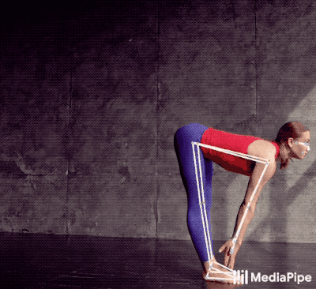

**Yoga pose classifier**

A yoga pose classifier is a computer vision model that can recognize and categorize different yoga poses based on input images or video. The classifier uses machine learning algorithms to analyze the pose of a person and then match it to a specific yoga pose. 

The architecture of a yoga pose classifier typically consists of the following: 

1. **Input module:** This module is responsible for capturing the image or video of the person performing the yoga pose. With the help of OpenCV we can access the webcam and apply models in real time.

1. **Pre-processing module:** This module is responsible for cleaning and preparing the input data for further analysis. It may include resizing, cropping, and normalization of the input image.

1. **Feature extraction module:** This module is responsible for extracting relevant features from the pre-processed input image. In our project we use mediapipe to capture the pose landmarks of the user.

These pose landmarks are used to calculate a pose embedding (a.k.a feature vector) from the detected landmark coordinates.

1. **Generating dataset for poses:** Preprocess the pose classification training data into a CSV file that specifies the pose landmarks (body keypoints) detected by mediapipe.

1. **Training classification model:** A multi-class classification model is trained with the feature vectors generated from the in the last part.

`  `

`         `Neural network for mulit-class classification

1. **Classifying yoga poses:** 
   1. The real time video is captured by OpenCV. 
   1. Pose landmarks of the user are generated by mediapipe and those landmarks are used to create feature vector.
   1. The trained multi-class classification model uses these feature vectors to classify the yoga pose.

1. **Convert pose classification model to TensorFlow Lite:** we'll convert the Keras pose classification model to the TensorFlow Lite format so that you can deploy it to mobile apps, web browsers and edge devices. 

1. **Output module:** This module is responsible for displaying the recognized yoga pose to the user. 

The software components used in a yoga pose classifier include programming languages such as Python, machine learning libraries such as TensorFlow and computer vision libraries such as OpenCV. 

The hardware components may include a camera or a video capture device, a CPU or GPU for processing the input data, and a display device for showing the recognized yoga pose. 

